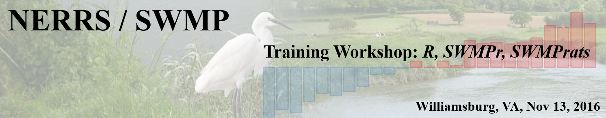

### Instructors

Kim Cressman - Grand Bay NERR, [Kimberly.Cressman@dmr.ms.gov](mailto:Kimberly.Cressman@dmr.ms.gov)  
Kari St. Laurent - Delaware NERR, [Kari.St.Laurent@state.de.us](mailto:Kari.St.Laurent@state.de.us)  
Marcus W. Beck - USEPA, [beck.marcus@epa.gov](mailto:beck.marcus@epa.gov)

See our [bio page](http://swmprats.net/swmprats-team) for more info.

### Description

The purpose of the training workshop is to give users a hands-on, interactive introduction to the R analysis platform, the SWMPr package for R, the widgets of SWMPrats, and selected time series topics.  

The **morning session** will cover the basics of R and SWMPr.  R is a data analysis software and programming language and SWMPr is an R package designed for working with SWMP data.  

The **afternoon session** will be an overview of the widgets of SWMPrats and selected time series topics.  The SWMPrats website was created to assist the NERRS program with analysis and interpretation of SWMP data.  Three widgets on the website allow users to summarize trends within and between sites using a point-and-click approach.  Selected time series topics will include weighted regression for trend analysis, time series decomposition, and Seasonal Kendall tests.  

Both sessions will prepare users to better navigate R software for tackling SWMP analysis problems.  You will finish the workshop with a working knowledge of data import, processing, basic plotting, basic analysis, and interpretation of results.  

### Come prepared:

Attendees must bring a **personal laptop** with the following items installed:

1) Install R v3.3.1 (or later): [Instructions](http://swmprats.net/workshop-2014/images/documents/R_install_guide.pdf) (page 1 - 4)

2) Install RStudio v0.99.903 (or later): [Instructions](http://swmprats.net/workshop-2014/images/documents/R_install_guide.pdf)
(page 5 - 6)

3) Install SWMPr v2.1.7: [Instructions](https://fawda123.github.io/swmp_workshop_2016/content/SWMPr_install)

4) Download training modules

5) Install WRTDStidal v.0.49.9000, [Instructions](https://fawda123.github.io/swmp_workshop_2016/content/WRTDStidal_install) (**afternoon session only**)

***Current software versions are required!***  *You will have problems if you have older versions installed.* ***The software installation will require Admin Rights on your computer!***  *If you do not have these rights, or do not know the password to allow these rights, your computer IT department/person will need to install this software BEFORE you come to the workshop.*

### Additional prep:

We strongly encourage you to review the following to better prepare for the workshop:

* Supplementary R resources: [Introduction](https://github.com/fawda123/swmp_workshop_2014/raw/master/preworkshop_toolkit/intro_to_r/intro_to_R.pdf) and [data analysis](https://github.com/fawda123/swmp_workshop_2014/raw/master/preworkshop_toolkit/r_for_data_analysis/R_for_data_analysis.pdf)

* SWMPr: [manuscript](https://journal.r-project.org/archive/2016-1/beck.pdf)

* Weighted regression in tidal waters with WRTDStidal: [manuscript](http://swmprats.net/images/Beck-and-Hagy-2015-weighted-regression-for-tidal-waters.pdf), [web site](https://github.com/fawda123/WRTDStidal)

