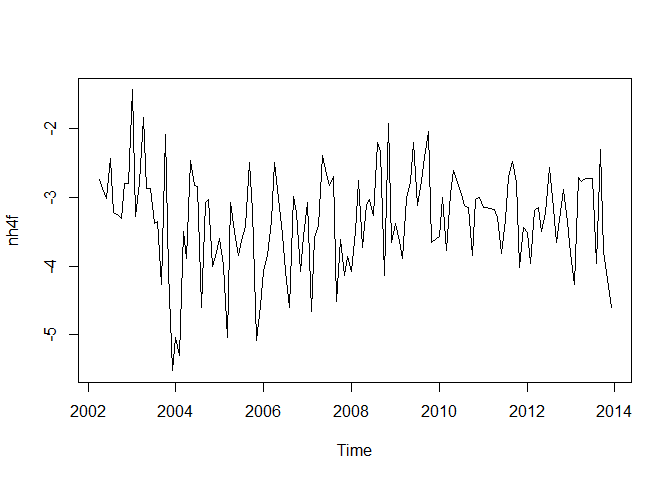
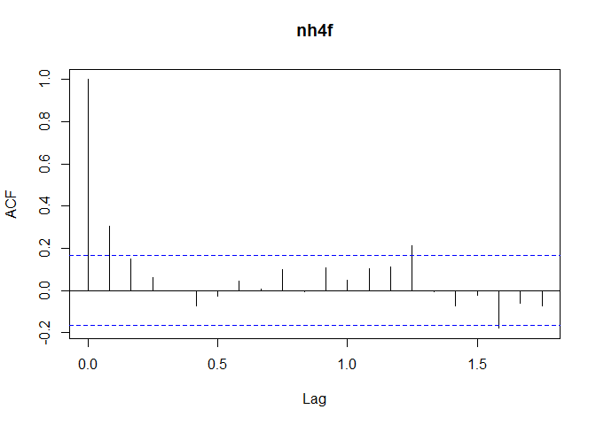

# Trend analysis example with SWMP data
Marcus W. Beck, beck.marcus@epa.gov  
October 6, 2016  

The following is an example of a simple trend analysis for SWMP nutrient data.  It uses the `SWMPr` package for data pre-processing, `Kendall` package for seasonal Mann Kendall tests, and `tidyverse` for additional data processing.

First, load the packages and example data.  Uncomment the lines to install missing packages as needed.

```r
# install.packages('SWMPr')
# install.package('Kendall')
# install.packages('tidyverse')
# install.packages('lubridate')
library(SWMPr)
library(Kendall)
library(tidyverse)
library(lubridate)

data(apacpnut)
```

The following manipulates the nutrient data in a format for trend analysis.  Processing is done with 'pipes' 
(`%>%`) to run functions in sequence.  The following steps are used to process the nutrient data.

1. Retain observations with 0 and 4 qaqc codes
2. Select ammonium
3. Create year, month columns 
4. Average observations by year, month combos to remove duplicates
5. Expand data by rows to create complete year, month sequence for time series object
6. Transform response for variance stabilization

```r
# qaqc removal, select ammonium, average month/year values, create complete time series, add decimal date
dat <- qaqc(apacpnut, qaqc_keep = c(0, 4)) %>% 
  subset(select = 'nh4f') %>% 
  mutate(
    year = year(datetimestamp), 
    month = month(datetimestamp)
  ) %>% 
  group_by(year, month) %>% 
  summarise(nh4f = mean(nh4f, na.rm = T)) %>% 
  ungroup %>% 
  complete(year, month) %>% 
  mutate(
    nh4f = log(nh4f)
    )
```

A `ts` object is now created from the processed data.  The `na.approx` function interpolates the missing values.  

```r
# create time series object, interpolate missing values
dat_ts <- select(dat, nh4f) %>%   
  ts(start = c(2002, 1), frequency = 12) %>% 
  na.approx
plot(dat_ts)
```

<!-- -->

The `SeasonalMannKendall` test evaluates the direction and significance of a trend in the time series.  This test accounts for seasonal changes as a confounding factor in trend evaluation by grouping observations by month.  This is analagous to the Mann Kendall test on invidual months across years.  The results return the tau value (-1 to 1) as a rank-based measure of the change over time.  The two-sided p-value shows the probability of observing a change in either direction due to random chance alone (small values indicate results are likely not due to chance).  These results show that a slight positive increase occurs in the time series but it is not significant.

```r
# seasonal mannkendall
SeasonalMannKendall(dat_ts)
```

```
## tau = 0.0686, 2-sided pvalue =0.28909
```

The seasonal Mann Kendall test assumes that the observations are not serially-correlated, i.e., observations closer in time are not likely to be related to each other.  This can be evaluated with an `acf` function that evaluates correlations of the time series with itself at different lags.  

```r
acf(dat_ts)
```

<!-- -->
